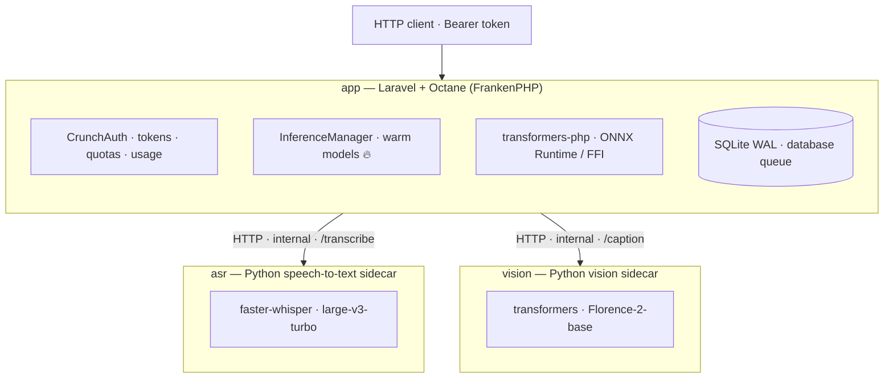

<div align="center">

# 🔪 CRUNCH

[](https://opensource.org/licenses/MIT)
[](https://php.net)
[](https://laravel.com)
[](https://laravel.com/docs/octane)
[](https://github.com/StuMason/crunch/actions/workflows/tests.yml)

**One bite encoder models. Fast, warm and delicious.**

> A self-hosted, OpenAI-compatible inference API for everything that *isn't* a chatbot —
> **embeddings, reranking, classification, moderation, image labelling, captioning and speech-to-text** —
> on a single box you own, at near-zero marginal cost.

🌐 **Live:** [crunch.stumason.dev](https://crunch.stumason.dev) · 📖 **Interactive docs:** [/docs/api](https://crunch.stumason.dev/docs/api)

</div>

---

## What is this?

The big AI APIs are built for *generating* — chat, completions, images. But most real apps need
the boring, brilliant **"one-shot" models** underneath: turn text into vectors, rank search
results, score sentiment, flag bad content, label an image, transcribe audio.

**crunch** is all of those behind **one API key, one base URL** — running on hardware you
already own. No GPU, no per-call meter, no data leaving your box. The encoder core is pure
PHP/ONNX (no Python) with models **warm in memory** ([Laravel Octane](https://laravel.com/docs/octane)
+ FrankenPHP), so calls come back in tens of milliseconds; speech-to-text runs in a small
companion Python sidecar.

It's the lean alternative to stitching together OpenAI + Cohere + Deepgram + a moderation
vendor — and to babysitting a pile of separate model servers.

## Capabilities

| Endpoint | What it does | Model |
| --- | --- | --- |
| `POST /v1/embeddings` | Text → vector (semantic search, RAG, similarity) | Qwen3-Embedding-0.6B (1024-d) |
| `POST /rerank` | Re-order candidates by true relevance to a query | ms-marco-MiniLM-L-12 |
| `POST /sentiment` | Emotion / sentiment across 28 categories | go_emotions |
| `POST /moderate` | Flag harmful content (multi-category) | KoalaAI Text-Moderation |
| `POST /classify-image` | Score an image against your own labels (zero-shot) | CLIP ViT-L/14 |
| `POST /caption` | Describe an image in words | Florence-2-base (Python sidecar) |
| `POST /ocr` | Read the text out of an image | Florence-2-base (Python sidecar) |
| `POST /detect` | Locate objects (boxes + labels) | Florence-2-base (Python sidecar) |
| `POST /ocr/batch` → `GET /jobs/{id}` | OCR many crops in one async job (returns `{box, text}` per crop) | Florence-2-base (Python sidecar) |
| `POST /transcribe` → `GET /jobs/{id}` | Speech → text + word timestamps (async) | Whisper large-v3-turbo (Python sidecar) |

Every model is a **one-line swap** in `config/crunch.php`.

## Why crunch

- **🔌 OpenAI-compatible** — point any OpenAI SDK at the base URL and embeddings just work.
- **⚡ Warm & fast** — Octane keeps models loaded; no cold reload per request.
- **📦 Lean stack** — SQLite + database queue; PHP/ONNX core container + Python speech-to-text and vision sidecars. No Postgres, no Redis, no GPU.
- **🔐 Yours** — self-hosted; your data never leaves your infrastructure.
- **🎛️ Batteries included** — API tokens, per-token rate limits + monthly quotas, usage
  dashboard, and auto-generated interactive docs, all built in.

## Quickstart

```bash
# 1. Create a token in the dashboard (/dashboard), then:
KEY="crunch_..."

# Embeddings (OpenAI-compatible)
curl -sX POST https://crunch.stumason.dev/v1/embeddings \
  -H "Authorization: Bearer $KEY" -H 'Content-Type: application/json' \
  -d '{"input":["hello world","goodbye world"]}'

# Rerank
curl -sX POST https://crunch.stumason.dev/rerank \
  -H "Authorization: Bearer $KEY" \
  -d '{"query":"healing peptide","texts":["BPC-157 repairs tissue","how to bake bread"]}'
```

```python
# Drop-in for the OpenAI SDK
from openai import OpenAI
client = OpenAI(base_url="https://crunch.stumason.dev", api_key="crunch_...")
client.embeddings.create(model="crunch", input=["hello", "world"])
```

Store the vectors in Postgres with [pgvector](https://github.com/pgvector/pgvector):
`embedding vector(1024)`, then `ORDER BY embedding <=> '[...]'`.

## Authentication

Send `Authorization: Bearer <token>` on every request. Create tokens in the dashboard — each
has a **rate limit** (req/min) and an optional **monthly quota**, and every call is logged for
the usage dashboard. Media endpoints (`/classify-image`, `/caption`, `/transcribe`) accept a
public `url`, a base64 string, or a multipart file upload.

Full, interactive reference (with "Try it"): **[/docs/api](https://crunch.stumason.dev/docs/api)**.

## How it works



Encoder inference runs in-process via [transformers-php](https://github.com/CodeWithKyrian/transformers-php).
Two capabilities ONNX can't do live in small Python sidecars: **transcription** (async — a queue
worker hands audio to the `asr` sidecar/faster-whisper, clients poll `/jobs/{id}`; verbatim models
like CrisperWhisper need a GPU, so turbo is the CPU-friendly choice) and **captioning** (synchronous
— `/caption` calls the `vision` sidecar/Florence-2-base, which transformers-php can't run).

## Self-hosting

Deploys from this repo's `docker-compose.yaml` — the `app` service (FrankenPHP base + FFI/ONNX/audio
libs; Vite builds the UI) plus the `asr` and `vision` Python sidecars. Persistent volumes hold the
model caches and the SQLite DB.

```bash
docker build -t crunch .
docker run -p 8000:8000 -v crunch-data:/data \
  -e APP_KEY=base64:... -e CRUNCH_API_KEY=... crunch
```

Local dev: `composer install && npm install && php artisan migrate && composer run dev`.
Tests: `php artisan test`.

## Roadmap

- Expose Florence-2's other tasks (OCR, object detection, region captions) as endpoints.
- Image embeddings + more models behind the same gateway.
- Automated model + library update tracking with alerts.

---

<div align="center">

Built by **[Stuart Mason](https://stuartmason.co.uk)** · [@StuMason](https://github.com/StuMason)

Made with idle ARM compute and spite for per-call pricing. MIT licensed — fork it, host it, hammer it.

</div>
